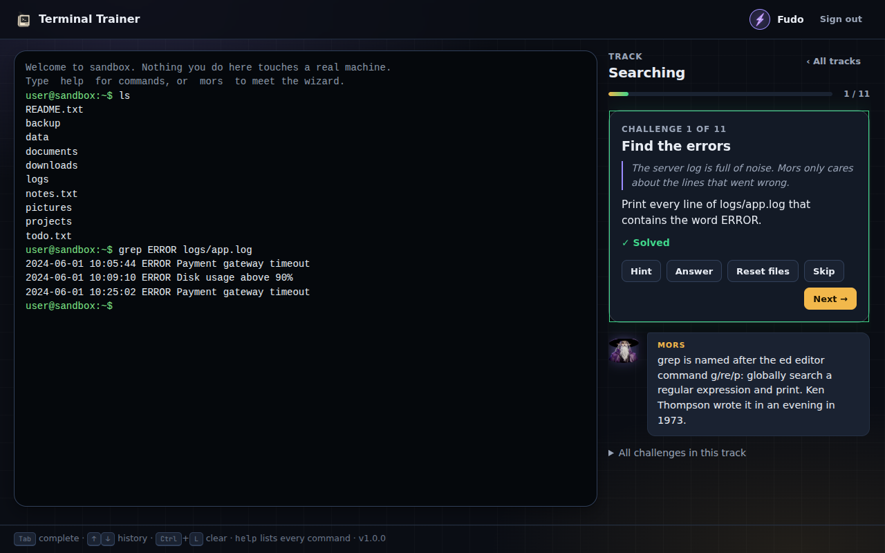
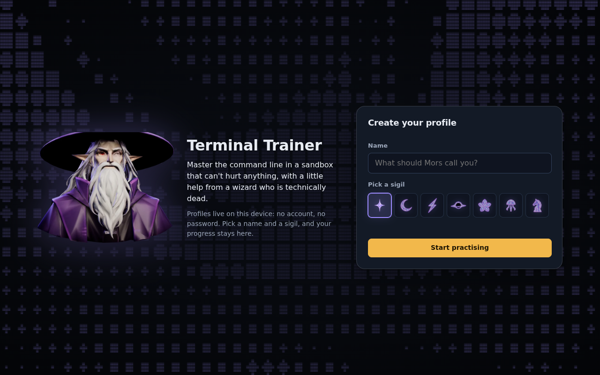
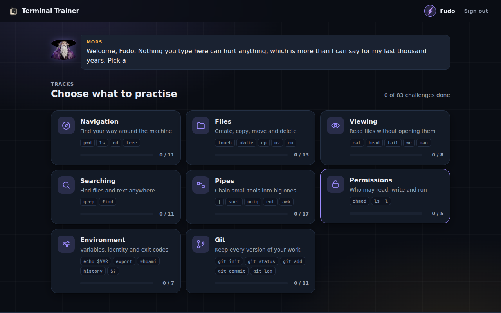

# Terminal Trainer

Get good at the Linux command line in a safe, simulated terminal, with story-driven challenges and Mors the Wizard for company. Nothing touches a real computer: the filesystem, the shell, `git` and every command are simulated, so you can `rm -rf` to your heart's content.

It comes in two flavours that share one engine:

| | Desktop web app | iOS / Android app |
| --- | --- | --- |
| Where | `apps/web` | `apps/mobile` |
| Run locally | `npm run dev` | `npm run dev:mobile` (browser) or `npm run mobile:ios` / `npm run mobile:android` |
| Interface | terminal beside the story panel | tabs: Home, Practice, Learn; key bar and suggestions above the phone keyboard |
| Deploy | any static host, GitHub Pages | App Store, Google Play (see [apps/mobile/README.md](apps/mobile/README.md)) |



<p>
  
  
</p>

## How it works

1. **Sign in.** Mors waits over a field of drifting terminal glyphs while you pick or create a profile (a name and a sigil). Profiles live on the device; each keeps its own progress.
2. **Meet Mors.** A cyber-wizard from the year 3026, technically dead, who lives in `/opt/mors` and leaves notes around the machine. He welcomes you, comments on every solved challenge with a bit of real Unix history, and answers `hint` and `mors help`.
3. **Choose a track.** Eight independent tracks: Navigation, Files, Viewing, Searching, Pipes, Permissions, Environment and Git. Take them in any order.
4. **Practise in the terminal.** Every challenge has a short story and a task. The terminal behaves like a real one and shows only what a terminal would; instructions, hints and Mors stay in the panel beside it. The only extra commands are `hint`, `skip` and `mors`.

## What you get

- **A realistic shell.** Pipes (`|`), redirects (`>`, `>>`, `<`), `&&` / `||` / `;`, quotes, `$VARIABLES`, `~`, wildcards (`*.txt`), Tab completion, history, `Ctrl+L`, `Ctrl+C`.
- **41 commands** with real error messages and `man` pages, including a working `git` (init, status, add, commit, log, diff, branch, switch, restore): `ls cd pwd tree cat touch mkdir rm rmdir cp mv chmod echo head tail wc grep sort uniq cut tr sed awk find which xargs git whoami hostname uname date history clear env printenv export unset true false help man`.
- **83 challenges** in eight tracks, each with a story beat, a hint, a reference answer and a comment from Mors. Several send you hunting for the notes he hid.
- **Local profiles** with separate progress, and a design system shared by both apps (see [docs/DESIGN.md](docs/DESIGN.md)).
- **Light to load.** About 140 KB gzipped for the whole web app, including React (used only to mount two visual effects) and the WebGL background on the sign-in page; the mobile app adds only Capacitor.

## Quick start

You need [Node.js](https://nodejs.org/) 20 or newer.

```bash
npm install
npm run dev            # desktop app  → http://localhost:5173
npm run dev:mobile     # mobile app in a browser (use the device toolbar)
npm test               # every test in every package
npm run build          # type-check and build both apps
```

## How it is organised

```
packages/
  core/     the simulated shell and git, 41 commands, Mors, profiles, the trainer and 83 challenges (pure TypeScript, no DOM)
  ui/       what both apps share: the terminal widget, the design system (theme.css), Mors's portrait and bubble, the sign-in page, the track menu, the artwork, the two React Bits effects
apps/
  web/      desktop web app: sign-in → home → practice with the story panel
  mobile/   iOS/Android app (Capacitor): tabs, key bar, native projects
docs/       DESIGN.md: the visual identity, research and Mors's voice
```

Layers only point downwards: apps use `ui` and `core`; `ui` uses `core`; `core` uses nothing. Each workspace has its own tests (`tests/` next to `src/`) and `npm test` at the root runs them all. Because the apps share the engine, a new command or exercise added to `packages/core` appears in both.

Each package has a README-level comment at the top of its main files; start with `packages/core/src/index.ts` to see the public API.

## Add a command

Add an object to the right file in `packages/core/src/core/commands/` (or a new file listed in `commands/index.ts`), test-first in `packages/core/tests/core/commands/`:

```ts
export const rev: Command = {
  name: "rev",
  category: "Text",
  summary: "reverse each line",
  usage: "rev [file...]",
  details: "Prints each line of FILE (or stdin) backwards.",
  run: (ctx) => readInputs("rev", ctx, ctx.args, (text) =>
    joinLines(splitLines(text).map((line) => [...line].reverse().join(""))),
  ),
};
```

`help`, `man`, Tab completion, the mobile Learn tab and the suggestion chips all pick it up automatically.

## Add a challenge

Append an object to the right track in `packages/core/src/trainer/tracks.ts`:

```ts
{
  id: "files-rev",              // unique and permanent (progress is stored by id)
  title: "Backwards",
  story: "Mors wants his notes read from the wrong end. Don't ask.",
  task: "Print notes.txt with every line reversed.",
  hint: "There is a command called rev.",
  solution: ["rev notes.txt"],  // the test suite runs this to prove the check works
  lore: "rev is one of the smallest Unix tools; it reverses lines and nothing else.",
  check: ({ result }) => result.stdout.startsWith("daerb"),
}
```

`check` runs after every command and receives the shell (files, current directory, variables, git repos), the line typed, and what it printed. An optional `setup(shell)` prepares files before the challenge starts. Every challenge begins from a fresh copy of the sample filesystem, Mors's notes included. `lore` is what Mors says when it's solved: keep it to a sentence or two of real history, in his voice (see `docs/DESIGN.md`).

## Accounts and Mors: what is local, and how to go further

Profiles and progress are stored on the device (localStorage in the browser, the app's storage on a phone). There is no server, which is why the app works offline and can ship to the stores without a backend. `ProfileStore` and the `ProgressStorage` interface in `packages/core` are the seams: implement them over an HTTP API (Supabase, Firebase, your own) to sync accounts across devices, and the apps stay unchanged.

Mors is scripted (`packages/core/src/mors/voice.ts`), so his lines are instant and offline. The `MorsVoice` interface is the seam for a model-backed Mors like the Discord bot he came from; that would need a small server to hold the API key, since keys can't ship inside an app.

## Artwork

Source images live in `packages/ui/src/assets`. To change them, replace the files and run `npm run assets -w packages/ui`, which regenerates the optimised versions the apps ship (see the table in `docs/DESIGN.md`). Mors's portrait is meant to come from `mors_pixel_vers.png`; until that file is added, the script uses `mors_render_v1.png`, a still of the 3D model, and says so. Native app icons are a separate step: `npm run assets -w apps/mobile` regenerates them from `apps/mobile/resources/`.

## Deploy the web app

`npm run build:web` writes a static site to `apps/web/dist/`; upload it anywhere. The GitHub Actions workflow tests every push, builds a debug Android APK and an iOS simulator build, and on pushes to the repository's default branch publishes the desktop app to GitHub Pages at `/` with the mobile web app at `/mobile/`. One-time setup: *Settings → Pages → Source: GitHub Actions*.

## Keyboard shortcuts (desktop)

| Key | Action |
| --- | --- |
| `Tab` | complete a command or path (press again to list options) |
| `↑` / `↓` | walk through history |
| `Ctrl+L` | clear the screen (same as `clear`) |
| `Ctrl+C` | cancel the line you are typing |
| `Ctrl+U` | erase the line you are typing |

On a phone the same actions are on the key bar above the keyboard.
